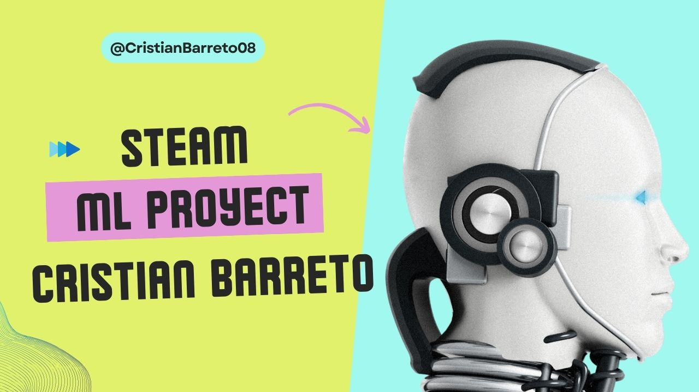
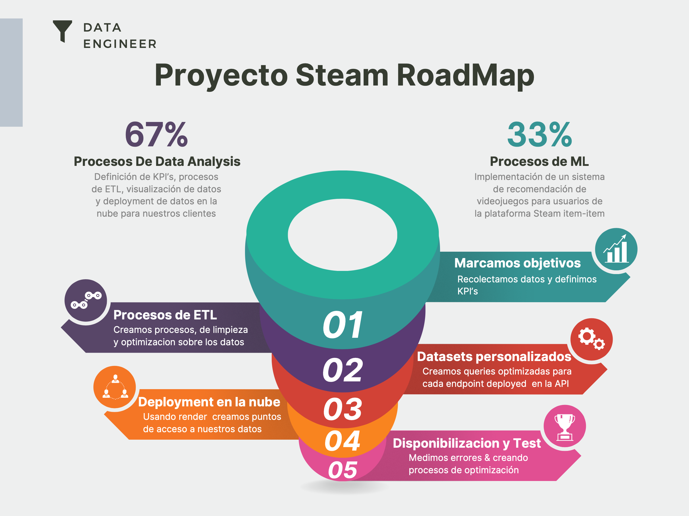
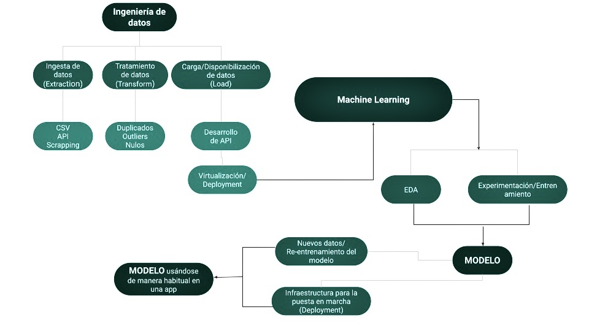

# Proyecto SteamInsights: MLOps

¡Bienvenido a SteamInsights! Este proyecto se centra en implementar un sistema de recomendación de videojuegos para usuarios en la plataforma de Steam. Como MLOps Engineer, enfrentamos el desafío de trabajar con datos crudos y no procesados, lo que dificulta la construcción del modelo.

## Objetivo

Construir un modelo de recomendación desde cero, optimizando la recolección y tratamiento de datos. El objetivo es desplegar un Minimum Viable Product (MVP) con una API en la nube, aplicando dos modelos de Machine Learning:

- **Análisis de Sentimientos:** Evaluar los comentarios de los usuarios sobre los juegos para categorizar su sentimiento.

- **Recomendación de Juegos:** Sugerir juegos similares a partir de uno seleccionado por el usuario.

Profundizando un poco, vamos a disponibilizar 5 funciones en la nube por medio de una API, basadas en los datos obtenidos de Stream y las diferentes Transformaciones aplicadas que darán respuesta a:

- **Endpoint 1 (PlayTimeGenre):** Devuelve año con mas horas jugadas para un género dado.

- **Endpoint 2 (UserForGenre):** Devuelve el usuario que acumula más horas jugadas para el género dado y una lista de la acumulación de horas jugadas por año.

- **Endpoint 3 (UsersRecommend):** Devuelve el top 3 de juegos MÁS recomendados por usuarios para el año dado.

- **Endpoint 4 (UsersWorstDeveloper):** Devuelve el top 3 de desarrolladoras con juegos MENOS recomendados por usuarios para el año dado.

- **Endpoint 5 (sentiment_analysis):** Según la empresa desarrolladora, se devuelve un diccionario con el nombre de la desarrolladora como llave y una lista con la cantidad total de registros de reseñas de usuarios que se encuentren categorizados con un análisis de sentimiento como valor.

# Proceso del Proyecto

## **Proyecto 1: Ingeniería de Datos (ETL y API)**

## **1. Transformaciones de Datos**

### **1.1 Descripción:**
   - Se realizaron transformaciones en tres archivos JSON, almacenados en la carpeta 'PI MLOps - STEAM' de un repositorio público en Google Drive.

   - El proceso de limpieza y transformación de datos culminó con la creación de nuevos archivos CSV con datos limpios y listos para su integración en la API.
  
### **Archivos Procesados:**
  - user_reviews.json: Reseñas de juegos por usuarios australianos.
 
  - steam_games.json: Información detallada sobre juegos disponibles en Steam.
  
  - users_items.json: Información sobre ítems relacionados con usuarios australianos.
  
### **Archivos Procesados:**
  - resumen_idiomas.csv

  - steam_games_limpios.csv

  - user_items_limpios.csv

  - user_reviews_limpios.csv

### **1.2 Feature Engineering**

#### **Descripción:**
   - Se creó la columna **'sentiment_analysis'** aplicando análisis de sentimiento a las reseñas de los usuarios.

   - Se utilizó NLTK (Natural Language Toolkit) con el analizador de sentimientos de Vader para categorizar las reseñas en negativas, neutrales o positivas.

### **1.3 Desarrollo de API**

**Descripción:**
   - Se implementó una API con FastAPI y se deployó en Render.

   - Proporciona cinco consultas sobre información de videojuegos, facilitando el acceso a los datos y funcionalidades del proyecto.

**Funciones de la API:**
   - Endpoint 1 (PlayTimeGenre)

   - Endpoint 2 (UserForGenre)

   - Endpoint 3 (UsersRecommend)

   - Endpoint 4 (UsersWorstDeveloper)

   - Endpoint 5 (sentiment_analysis)

#

## **2. Análisis Exploratorio de Datos (EDA)**

**Descripción:**
   - Investigación de relaciones entre variables, identificación de outliers y patrones interesantes en los datos.
   - El análisis se realizó para comprender mejor la estructura y características de los conjuntos de datos.

## **3. Modelo de Aprendizaje Automático**

**Descripción:**
   - Creación de un sistema de recomendación basado en el enfoque ítem-ítem.
   - Se utilizó el método de similitud del coseno para recomendar juegos similares a partir de un juego dado.
   - Implementación del modelo como parte de la API, ofreciendo recomendaciones personalizadas a los usuarios.

## **4. Implementación de MLOps**

**Descripción:**
   - Despliegue del modelo de recomendación como parte de la API, permitiendo su acceso desde cualquier dispositivo conectado a internet.
   - Utilización de servicios en la nube como Render para el despliegue y disponibilidad del modelo.

## **5. Video Explicativo**

**Descripción:**
   - Se grabó un video explicativo que muestra el funcionamiento de la API y las consultas realizadas.
   - También se proporciona una breve explicación de los modelos de ML utilizados y su impacto en la recomendación de juegos.

## **6. Estructura del Repositorio**

1. /Notebooks: Contiene los Jupyter Notebooks con el código completo y bien comentado donde se realizaron las extracciones, transformaciones y carga de datos (ETL), análisis exploratorio de los datos (EDA), y el archivo con Diccionario de datos, MVP, Pautas del proyectoVarios.
   
2. /Datasets: Almacena los datasets utilizados en una versión limpia y procesada de los mismos. Las fuentes de datos iniciales se encuentra almacenadas en la carpeta input en el siguiente repositorio Google Drive.

3. /Archivos_API: Contiene los datasets en formato CSV consumidos por la API.

4. /Archivos_Limpios: Contiene los archivos depurados después de haber realizado el ETL.

5. /Archivos_ML: Contiene los archivos consumidos por la API para hacer el sistema de recomendación.

6. /assets: Carpeta con imágenes y recursos utilizados en el desarrollo del proyecto.

7. /Video: Contiene el video explicativo del proyecto, publicado en Youtube.