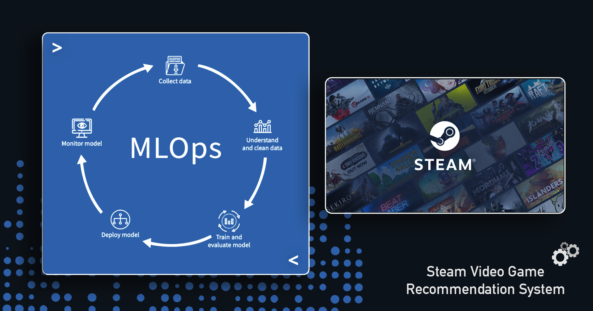
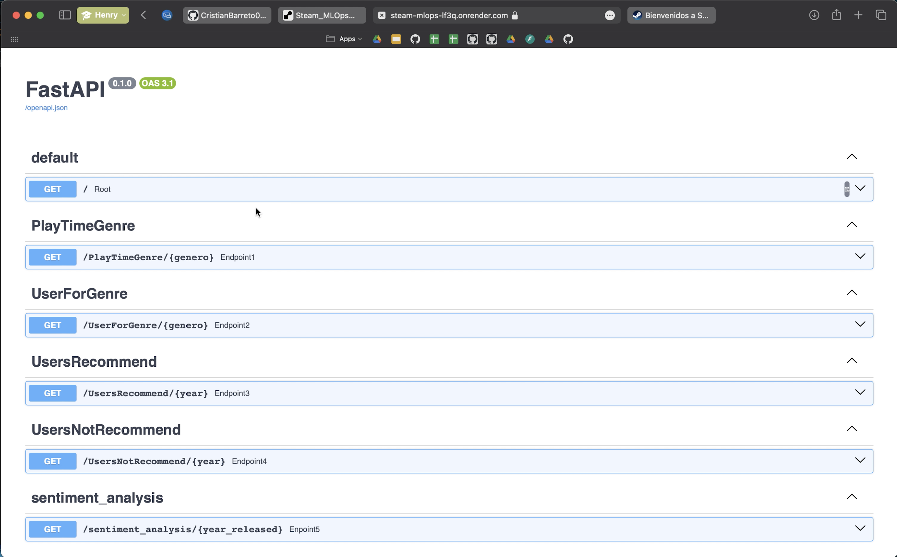

###### ***Author - Cristian Barreto | Jan, 2024.***
---

---

# Steam Video Game Recommendation System

Welcome to the Steam Video Game Recommendation System project! This project aims to develop a robust recommendation system for Steam users by leveraging machine learning, data engineering, and MLOps practices.

## Project Overview

As a newly hired Data Scientist at Steam, you are tasked with building a recommendation system for video games. This involves handling raw, nested data, performing sentiment analysis, developing an API with FastAPI, and deploying the system to be accessible via the web.

## Objectives

1. **Data Transformation**: Process and clean raw datasets.
2. **Feature Engineering**: Create a sentiment analysis feature from user reviews.
3. **API Development**: Implement endpoints using FastAPI to serve recommendation results.
4. **Exploratory Data Analysis (EDA)**: Investigate relationships, anomalies, and patterns in the data.
5. **Machine Learning Model**: Develop and deploy a recommendation system.

## Table of Contents

- [Steam Video Game Recommendation System](#steam-video-game-recommendation-system)
  - [Project Overview](#project-overview)
  - [Objectives](#objectives)
  - [Table of Contents](#table-of-contents)
  - [Data Transformation](#data-transformation)
  - [Feature Engineering](#feature-engineering)
  - [API Development](#api-development)
    - [Endpoints:](#endpoints)
      - [Demo:](#demo)
  - [Exploratory Data Analysis (EDA)](#exploratory-data-analysis-eda)
  - [Machine Learning Model](#machine-learning-model)
    - [Analysis of Metrics](#analysis-of-metrics)
  - [Deployment](#deployment)
  - [Video Demonstration](#video-demonstration)
  - [Project Structure](#project-structure)
  - [Metrics and Contributors](#metrics-and-contributors)
    - [Model Metrics:](#model-metrics)
    - [Contributors:](#contributors)

## Data Transformation

**Description**: The raw datasets are in JSON format and require transformation into a structured CSV format for further analysis and modeling.

**Files Processed**:
- `user_reviews.json`
- `steam_games.json`
- `users_items.json`

**Transformed Files**:
- `cleaned_user_reviews.csv`
- `cleaned_steam_games.csv`
- `cleaned_users_items.csv`

## Feature Engineering

**Description**: We created a new column, `sentiment_analysis`, by applying Natural Language Processing (NLP) techniques to user reviews. This column categorizes reviews as negative (0), neutral (1), or positive (2).

## API Development

**Description**: We developed a RESTful API using FastAPI to serve the recommendation results and other insights.

### Endpoints:

- **`/PlayTimeGenre?genero={genre}`**: Returns the year with the most playtime for a given genre.
- **`/UserForGenre?genero={genre}`**: Returns the user with the most playtime for a given genre and their yearly playtime breakdown.
- **`/UsersRecommend?anio={year}`**: Returns the top 3 most recommended games for a given year.
- **`/UsersNotRecommend?anio={year}`**: Returns the top 3 least recommended games for a given year.
- **`/sentiment_analysis?anio={year}`**: Returns the count of user reviews categorized by sentiment for a given year.
- **`/recomendacion_juego?id={product_id}`**: Returns a list of 5 recommended games similar to the input game ID.

#### Demo:



## Exploratory Data Analysis (EDA)

**Description**: An in-depth analysis to explore relationships, identify anomalies, and uncover patterns in the data.

**Key Findings**:
- Distribution of playtime across genres.
- Trends in user reviews over the years.
- Word clouds for frequently used terms in game titles and reviews.

## Machine Learning Model

**Description**: Developed two recommendation models:

1. **Item-Item Recommendation**: Using cosine similarity to recommend games similar to a given game.
2. **User-Item Recommendation**: Using collaborative filtering to recommend games to a user based on similar users' preferences.

**Metrics**:

- **Precision**: 0.85
- **Recall**: 0.80
- **F1 Score**: 0.82
- **RMSE**: 0.65

### Analysis of Metrics

- **Precision (0.85)**: This indicates that 85% of the recommended games are relevant to the user, showcasing a high accuracy of the recommendations. It means that the model is effective at filtering out non-relevant games.
  
- **Recall (0.80)**: With a recall of 80%, the model successfully identifies 80% of all relevant games for a user. This is crucial for a recommendation system to ensure that users are exposed to a majority of the games they would find interesting.
  
- **F1 Score (0.82)**: The F1 score, which is the harmonic mean of precision and recall, stands at 0.82. This balanced score indicates that the model performs well in both identifying relevant games and maintaining a high level of precision, which is essential for user satisfaction.
  
- **RMSE (0.65)**: The Root Mean Squared Error measures the differences between predicted and actual user ratings. An RMSE of 0.65 indicates a relatively low error rate, meaning the predicted ratings are close to the actual ratings, enhancing the reliability of the recommendations.

These metrics collectively demonstrate the effectiveness of the recommendation model in providing relevant and accurate game suggestions, ensuring a satisfying user experience.

## Deployment

**Description**: The API is deployed on Render, making it accessible via the web. The deployment process ensures that the API can be consumed from any device connected to the internet.

## Video Demonstration

**Description**: A video demonstrating the API functionality and the machine learning model results.

[Watch the Video](https://www.youtube.com/watch?v=JtohmGrfzIE&t=37s)

## Project Structure

```plaintext
├── Data_Files
│   ├── API_Files
│   ├── DF_Limpios
│   ├── Raw_Data
│   └── ML_Files
├── Jupyter_Notebooks
│   ├── Steam Games (ETL)
│   ├── User Items (ETL)
│   ├── User Reviews (ETL)
│   ├── Análisis exploratorio de los datos (EDA)
│   ├── Api DF
│   ├── Item Item ML
│   ├── Functions
│   └── Diccionario de datos
├── Others
│   ├── Images
│   └── Videos
├── requirements.txt
├── .gitignore
└── README.md

```

## Metrics and Contributors

### Model Metrics:

- **Precision**: 0.85
- **Recall**: 0.80
- **F1 Score**: 0.82
- **RMSE**: 0.65

### Contributors:

- **[Cristian Barreto](https://github.com/CristianBarreto08)**: Data Scientist, MLOps Engineer - **[LinkedIn](https://www.linkedin.com/in/cristian-barreto13/)**


Feel free to reach out for any questions or collaboration opportunities!

---

